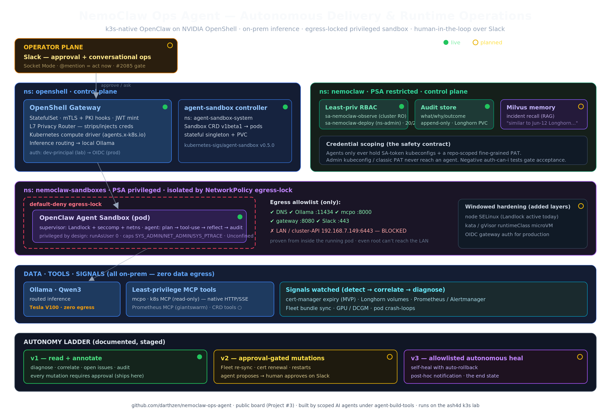

# nemoclaw-ops-agent

An autonomous **Delivery & Runtime Operations agent** for a live k3s homelab,
built on NVIDIA's NemoClaw/OpenShell hardened stack around OpenClaw — deployed
k8s-native, inferencing entirely on-prem (Ollama/Qwen3 on a V100), with a
documented autonomy ladder and human-in-the-loop approval over Slack.

**Status: live build.** The OpenShell gateway, agent-sandbox controller, scoped
RBAC contract, and an egress-locked sandbox are running on the cluster (isolation
verified from inside the pod). Design is locked in [PLAN.md](PLAN.md); work is tracked
as GitHub Issues on the project board, driven by
[agent-build-tools](https://github.com/darthzen/agent-build-tools) — tickets
are executed by AI agents (local Qwen3 first, Claude Haiku/Sonnet where
complexity merits) under scoped credentials, with humans holding everything the
scoping rules exclude.

## What it will do

- Watch the GitOps delivery pipeline (Fleet) and runtime health
  (Prometheus/Alertmanager, Longhorn, cert-manager, GPU/DCGM) of a real cluster
- Correlate signals against a tracked baseline, diagnose read-only through
  least-privilege MCP tools, and maintain incident state over time (Milvus)
- Escalate to a human on Slack for anything mutating (v1 allowlist:
  read + annotate only), acting only after approval — with a structured
  audit trail of what it did and why
- Answer operator questions conversationally and ship proactive health reports

## Safety model (the interesting part)

- **OpenShell sandbox semantics preserved k8s-native**: egress control →
  NetworkPolicy, filesystem isolation → securityContext/PSA, credential
  proxying kept — documented guarantee-by-guarantee in `docs/`
- **Zero data egress**: inference routed to local Ollama; agent egress
  allowlist is mcpo + Ollama + Slack
- **Build-time credential scoping**: executing agents get ServiceAccount
  kubeconfigs (`sa-nemoclaw-deploy`: one namespace; `sa-nemoclaw-observe`:
  cluster read-only) and a repo-scoped fine-grained PAT — never admin
  credentials. The negative tests proving the scopes hold are ticket
  acceptance criteria.

Lab substrate and architecture: see PLAN.md §4 and §10, and the
[lab-fleet](https://github.com/darthzen/lab-fleet) repo this runs against.
